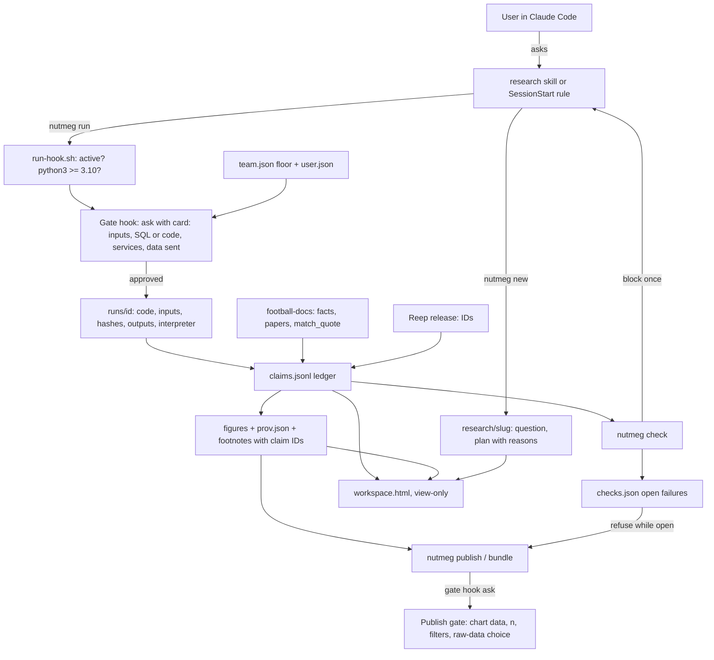
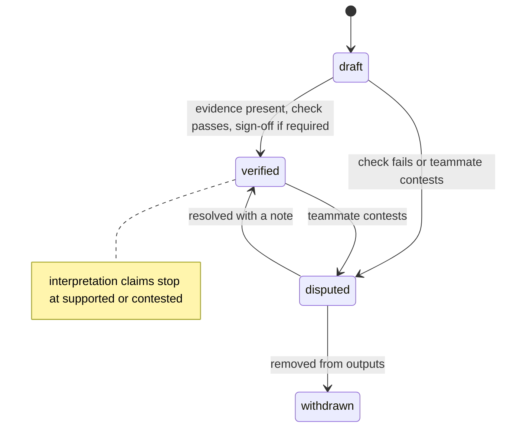
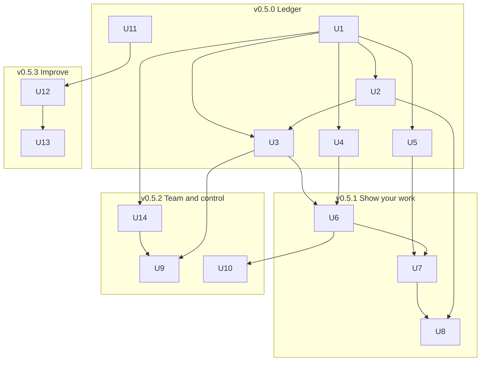

# Nutmeg v0.5 Research Ledger - Plan

## Goal Capsule

- **Objective:** ship the first research-assistant loop in nutmeg for fanalysts and club data scientists: a claim ledger, review gates before anything runs or publishes, short reasons for every choice, chart provenance, a view-only workspace page, team and user config, autonomy levels, bundles and the first hill-climbing loop.
- **Authority:** the Product Contract wins on behaviour; Key Technical Decisions win on mechanism; units neither override.
- **Execution profile:** increments v0.5.0 to v0.5.3, each releasable on its own. Work in a worktree. Commit per unit.
- **Stop conditions:** stop and ask when a unit needs a provider fact that football-docs does not hold, when a change would block club data (R18 says show, never block), or when the private held-out repo must be created (outward action).
- **Tail ownership:** each increment ends with the eval suite (Sonnet agent, Haiku judge), a version bump, release notes and a PR. Merges and releases need the owner's go-ahead.

---

## Product Contract

### Summary

v0.5 turns nutmeg into a research assistant that shows its work. Every number, provider fact, ID and citation in a research project goes into a claim ledger with its evidence. The user approves the inputs and the exact code or SQL before anything runs, and the chart data before anything publishes. Each choice carries a short reason. A view-only workspace page shows all of this, and a team config sets the minimum gates for everyone on a team. Metric-registry use waits for football-docs metric cards.

### Problem Frame

Data scientists distrust agent output. They want to check inputs, queries and chart data themselves, and they want to know why a choice was made. Fanalysts want public content that others can trust: sourced numbers and visible method. Nutmeg v0.4.0 grounds provider facts and IDs, but it leaves no trail from a number to the run, filter or source behind it. The v0.4.0 evals also showed that the model often skips the skills and calls tools directly, so rules that live only in skill text do not reach it reliably.

### Actors

- A1. Fanalyst: public data, content output, wants speed and credible sourcing.
- A2. Club data scientist: licensed data, decision memos, wants control before anything runs.
- A3. Teammate: opens a claim someone else made, to check, contest or sign it off.

### Requirements

**Claim ledger**

- R1. A research project keeps a claim ledger: one record per number, provider fact, ID, citation, definition or interpretation that appears in its outputs.
- R2. Each claim records its evidence: a recorded run for computed values, a football-docs source for provider facts, a Reep ID with release stamp for identities, a resolved paper or web source with a quote match for citations.
- R3. An interpretation claim links to the claims it rests on and is never marked verified.
- R4. A `why` view shows, for any claim, its value, definition, code lines, filters, sample size, sources and a few sample rows.

**Review gates**

- R5. Before any analysis code or SQL runs, the user sees its inputs (sources, filters, joins) and the exact code or SQL, and approves it; a re-run shows only what changed since the last approved run.
- R6. Before any chart or report is published or exported, the user sees the data behind each chart (rows, n, filters) and approves it.
- R7. Both gates are on by default for club data scientists; no setting can go below the team floor (R22), and any change to gate settings is recorded and asked again.
- R26. A research project starts for analyse-and-publish or decision requests even when the model does not load a skill.

**Reasons and meaning**

- R8. Every choice in a project plan (metric, filter, join, threshold, source) shows why it was chosen and what that rests on: a definition, a football-docs page, a practitioner rule or the user's instruction.
- R9. Football analytics terms in the plan, reports and workspace page link to what they mean.
- R10. Reasons stay one sentence; the detail opens on demand.

**Checks**

- R11. Before a research step ends, nutmeg checks that every number in the project's outputs maps to a ledger value, every citation resolves, and every provider fact has a source; unresolved failures stay open, and publishing refuses until each is fixed or accepted with a recorded reason.
- R12. Gates and checks run only inside an active research project and never affect ordinary nutmeg use.

**Charts and workspace**

- R13. Every chart from a research project carries a footnote (source, competition and season, filters, n, metric, uncertainty method, date, claim IDs) and a machine-readable provenance file.
- R14. A workspace page shows the question, the plan with reasons, the review queue, the ledger and the charts with their provenance; it is view-only in v0.5 and states when it was generated.
- R15. A team can share the project folder so a teammate can open any claim and its evidence.

**Team**

- R21. A teammate can contest a claim with a note, and the author or a teammate can resolve it with a note; both are recorded with a name.
- R22. Team config sets minimum gates, persona defaults, approved AI providers, licence notes per provider, the data-in-git policy and sign-off rules; user config can be stricter than the team floor, never looser.
- R23. When the team requires sign-off, a headline claim is verified only by a named teammate who is not its author.

**Control, data and bundles**

- R16. The user sets an autonomy level per stage: L1 suggest, L2 draft, L3 execute with checkpoints; defaults are L3 for fanalysts and L2 for club data scientists.
- R17. A bundle export always includes the code, environment, question, plan, ledger, receipts and data manifest; each export asks whether to include raw data, with a licence warning.
- R24. API keys and tokens never appear in run records, gate cards, the workspace page or bundles.
- R25. Each new project follows the team's data-in-git policy; without a team policy, nutmeg asks whether to keep data and run outputs out of git.

**Club data**

- R18. Nutmeg never blocks a step that sends club data to the club's AI provider or to a web or third-party tool; the run gate shows which data and which services a step will use, labels what it could not inspect, and names whether each service is team-approved.

**Evaluation**

- R19. The public eval suite covers the new behaviour, and a private held-out set stays out of the public repo.
- R20. A hill-climbing loop changes one thing per round and keeps a change when its target cases improve and the public suite does not fall; the held-out set is scored at the end of the loop and must not fall. The first target is the possession-as-quality failure.

### Key Flows

- F1. Research project, club data scientist (L2)
  - **Trigger:** the user asks for analysis to publish or decide on, for example a shortlist or a match report.
  - **Steps:** nutmeg starts a project, writes a question card and a plan with reasons; the user approves the plan; each run shows a gate card and the user approves; results go into the ledger; charts get footnotes; the Stop check blocks once on failures; the publish gate shows chart data and the user approves; the workspace page updates.
  - **Covered by:** R1, R2, R5, R6, R8, R11, R13, R14, R16, R26

- F2. Teammate check
  - **Trigger:** a teammate opens a shared project.
  - **Steps:** they open the workspace page or run `why` on a claim; they see the evidence and the reason; they contest the claim with a note or sign it off.
  - **Covered by:** R4, R15, R21, R23

### Acceptance Examples

- AE1. Covers R11. Given a report with "npxG/90 rose to 1.78" and no ledger claim with value 1.78, the first attempt to end the step is blocked with one orphan listed; if it is still unfixed, the failure stays open and `publish` refuses until it is fixed or accepted with a reason.
- AE2. Covers R7, R16, R22. Given a fanalyst who chose run-then-review and a team floor that allows it, `nutmeg run` proceeds without a prompt and its card is queued for review.
- AE3. Covers R12. Given no active research project, no gate, check or Python process runs, and Claude Code's normal permission flow applies.
- AE4. Covers R18. Given a club script that calls a third-party API with player data through a helper module, the card lists the host it detected, names the helper module as not inspected, lists the AI provider as a recipient of the run's output, and does not block.
- AE5. Covers R2. Given a citation to Singh's xT post, the claim stores the resolved source and a quote match of at least "normalised"; a citation with no match is open as unresolved.
- AE6. Covers R21. Given a teammate who runs `nutmeg contest C12 --note "excludes extra time?"`, the claim shows disputed with the note and the teammate's name in `why` and on the workspace page.
- AE7. Covers R5. Given a command `nutmeg run a.py && rm x`, the gate does not approve it as a run.
- AE8. Covers R5, R26. Given an active club project, a direct `python3 analysis.py` call raises a gate card saying the run will not be recorded.

### Scope Boundaries

- Company mode (protected evaluator, holdout harness for model building), the librarian and stats-reviewer agents, question-card locking, hosted team pages and RO-Crate export are out of v0.5.
- Clickable approvals inside the workspace page are out of v0.5; approvals happen in Claude Code.
- Campos provenance components are not built here; v0.5 publishes the provenance file contract they will read.
- Notebook cells are out of v0.5; runs are scripts (.py, .R, .sql).

#### Deferred to Follow-Up Work

- Metric-registry use: nutmeg reading football-docs metric cards for definitions and code. Blocked on football-docs shipping metric cards, which are parked.
- Team house definitions on top of metric cards.
- A local server for page-side approvals.

### Dependencies

- football-docs 0.16.x for provider facts, provider-coverage hints and paper tools (`search_papers`, `get_paper`, `get_web_source`, `read_paper`, `match_quote`).
- The Reep Register release DuckDB for identity claims.
- A private repository for the held-out eval set (to be created with the owner's approval).

---

## Planning Contract

### Key Technical Decisions

- KTD1. **Open core in Python, standard library only, behind a shell wrapper.** A `core/` package (`nutmeg_core`) holds the ledger, checks and the `nutmeg` command; `core/nutmeg.py` runs it with no install. Hooks call `hooks/run-hook.sh`, which exits at once when no project is active and degrades to a one-time warning when `python3` is missing or older than 3.10, before Python starts. (session-settled: user-approved — chosen over Node: it matches the users' analysis stack.) Conflict call-out: Node is required for football-docs and Python is not; the wrapper keeps R12 true either way.
- KTD2. **Fanalyst fast lane and club draft mode first.** Governs R7, R16. (session-settled: user-approved — chosen over club-only, fanalyst-only or all three: one ledger core serves both with different defaults.)
- KTD3. **A research project is a folder in the user's repo.** `research/<slug>/` holds `question.md`, `plan.md`, `claims.jsonl`, `receipts.jsonl`, `runs/`, `figures/`, `data/manifest.json` and `workspace.html`. The per-user marker `research/.active` is always gitignored. `claims.jsonl` gets a `merge=union` git attribute so concurrent appends merge.
- KTD4. **Runs go through `nutmeg run`, and the skills always call it as `python3 "${CLAUDE_PLUGIN_ROOT}/core/nutmeg.py" run`.** The command records code, inputs with hashes, SQL, outputs, stdout and the interpreter under `runs/<id>/`. A recorded run is the only evidence for a computed value.
- KTD5. **One PreToolUse gate hook for runs, publish and bundle.** Inside an active project it:
  1. Parses the Bash command with `shlex` and matches only a single `nutmeg run|publish|bundle` call (either command form in KTD4) with no shell operators.
  2. Also matches direct interpreter and query calls (`python`, `python3`, `Rscript`, `duckdb`, `sqlite3`, `psql`, `bq`) and asks with a "not recorded" card.
  3. Returns "ask" with a gate card; returns "allow" only for run-then-review when the team floor and user config allow it.
  4. Writes the card to `runs/.pending/<command-hash>.json`; `nutmeg run` moves it into `runs/<id>/gate.json` and flags any hash change.
  5. Emits no decision outside an active project, so Claude Code's normal permission flow applies.
- KTD6. **Publish and bundle are non-interactive commands gated by the hook.** `nutmeg bundle` requires `--raw yes|no`; the hook shows chart data or the raw-data licence note in the permission prompt. `publish` refuses while checks have open failures.
- KTD7. **Checks block once, then stay open.** `nutmeg check` validates orphan numbers, unresolved citations and unsourced provider facts in the project's output files (reports, figure captions), not the chat. The Stop hook returns a block decision with the failure list on the first stop and allows the stop when `stop_hook_active` is true. Open failures persist in `checks.json`; `nutmeg check --accept <item> --reason` records an override. Messages name what failed, not how the check works.
- KTD8. **Citations use football-docs paper tools.** A literature claim stores the `get_paper` or `get_web_source` identifier and the `match_quote` result; nutmeg builds no resolver of its own.
- KTD9. **Reasons live in the plan and the ledger; the glossary is a fixed list.** Each plan choice and claim carries `why` (one sentence) and `rests_on` (typed pointer: docs, registry, rule, user). `docs/glossary.md` holds the existing learn-skill terms only, gains no new metric definitions, and gives way to metric-card links when those exist. The workspace page inlines the glossary entries it links.
- KTD10. **Workspace page is static HTML regenerated by `nutmeg workspace`.** View-only, no server, no scripts, a restrictive Content-Security-Policy, only http, https and relative links. (session-settled: user-approved — chosen over clickable approvals in v0.5.0: approvals need a local server.) Governs R14.
- KTD11. **Provenance file contract.** Each figure gets `<name>.prov.json` with source, filters, n, metric, uncertainty, run ID, claim IDs and a CSV or JSON data snapshot. Campos and the workspace both read this contract. (session-settled: user-approved — chosen over workspace-only or campos-first.)
- KTD12. **Club data: show, never block.** Governs R18. (session-settled: user-directed — chosen over an egress guard or local models only: a club using a sanctioned AI provider owns its data handling.)
- KTD13. **Bundles ask about raw data every time.** Governs R17. "Raw data" means `data/`, run output files, figure data snapshots and sample rows in gate cards; a "no" bundle keeps only their hashes. (session-settled: user-directed — chosen over manifests only or raw data always.)
- KTD14. **Private held-out set in a separate private repo.** `run_suites.py` links it into a gitignored `evals-holdout/` below the plugin root and writes its results outside the repo. (session-settled: user-approved — chosen over keeping all cases public: public cases leak into optimisers and training data.)
- KTD15. **Registry use waits for football-docs.** (session-settled: user-approved — chosen over interim nutmeg-side definitions: facts stay in football-docs.)
- KTD16. **Team and user config, team as floor.** Team config is `.nutmeg/team.json` in the team's repo, changed by normal review. User config is `nutmeg/user.json` in the user's config folder, written only by setup. The gate takes the stricter of the two and asks again when either file changes mid-session. Governs R7, R22, R23. (session-settled: user-approved — chosen over a single project profile or user-level only: a team needs a shared floor and the project profile is editable by the model.)
- KTD17. **Redact before writing.** `nutmeg run`, the gate card builder, the workspace renderer and the bundle writer replace values of variables loaded from `.env` and `.nutmeg.credentials.local`, and URL parameters named like token, key or secret, with a fixed placeholder. File arguments must resolve inside the repo.
- KTD18. **`nutmeg run` supports .py, .R and .sql.** The interpreter comes from the file extension on PATH (`python3`, `Rscript`; `duckdb` for .sql, else `sqlite3`), never the core's own Python; `--interpreter` overrides; the run records which ran. (session-settled: user-directed — chosen over Python only or Python and R.)
- KTD19. **Data in git follows team policy, else a per-project question.** (session-settled: user-directed — chosen over ignoring data by default or committing everything.)

### High-Level Technical Design

### Assumptions

- Users who start research projects have `python3` 3.10 or newer; others get a one-time warning and no gates.
- Runs are scripts; notebook cells are out of v0.5.

---

## Implementation Units

| U-ID | Title | Key files | Depends on |
|---|---|---|---|
| U1 | Core package and ledger schema | `core/nutmeg_core/ledger.py`, `core/nutmeg.py` | none |
| U2 | Research project and research skill | `skills/research/SKILL.md`, `core/nutmeg_core/project.py` | U1 |
| U3 | Run recorder and gate hook | `core/nutmeg_core/run.py`, `core/nutmeg_core/gate.py`, `hooks/run-hook.sh` | U1, U2 |
| U4 | Checks and Stop hook | `core/nutmeg_core/check.py`, `hooks/stop_check.py` | U1 |
| U5 | why, trace, contest and resolve | `core/nutmeg_core/why.py` | U1 |
| U6 | Chart provenance and publish | `core/nutmeg_core/figure.py`, `core/nutmeg_core/publish.py` | U3, U4 |
| U7 | Workspace page | `core/nutmeg_core/workspace.py` | U5, U6 |
| U8 | Reasons and glossary | `docs/glossary.md`, `skills/research/SKILL.md` | U2, U7 |
| U9 | Autonomy levels | `core/nutmeg_core/gate.py`, `skills/nutmeg/references/init-flow.md` | U3, U14 |
| U10 | Bundles | `core/nutmeg_core/bundle.py` | U6 |
| U11 | football-docs 0.16 pin, mock re-record, new eval cases | `.mcp.json`, `evals/` | none |
| U12 | Private held-out set and runner | `evals/_scaffold/run_suites.py` | U11 |
| U13 | First hill-climb: possession as quality | `docs/metric-misuse.md`, `skills/analyse/SKILL.md` | U12 |
| U14 | Team and user config, sign-off | `core/nutmeg_core/config.py` | U1 |

### U1. Core package and ledger schema

- **Goal:** a standard-library Python package with the claim schema, ledger read and write, redaction helpers and the `nutmeg` command entry point.
- **Requirements:** R1, R2, R3, R24; KTD1, KTD3, KTD17.
- **Files:** `core/pyproject.toml`, `core/nutmeg_core/__init__.py`, `core/nutmeg_core/cli.py`, `core/nutmeg_core/ledger.py`, `core/nutmeg_core/redact.py`, `core/nutmeg.py`, `core/tests/test_ledger.py`, `core/tests/test_redact.py`, `.github/workflows/ci.yml`.
- **Approach:**
  1. Define claim kinds (computed, provider_fact, identity, literature, definition, interpretation) and statuses (draft, verified, disputed, withdrawn; supported or contested for interpretations). One status name, "disputed", is used everywhere for contested non-interpretation claims.
  2. Validate each record on write; reject unknown kinds and missing evidence fields per kind; records carry an optional note, author and signer.
  3. Append-only writes; updates append a new version with the same claim ID.
  4. Add a Python test job to CI on the minimum supported version (3.10).
- **Patterns to follow:** stdlib-only scripts in `evals/_scaffold/`.
- **Test scenarios:**
  - A computed claim with a run ID and value writes and reads back unchanged.
  - A computed claim with no run ID is rejected with a field-level message.
  - An interpretation claim with no linked claims is rejected.
  - An interpretation claim cannot be set to verified.
  - Two writes with the same claim ID return the latest version on read.
  - A malformed line in `claims.jsonl` is reported with its line number and does not hide valid lines.
  - Redaction replaces an `.env` value and an `api_token=` URL parameter with the placeholder.
- **Verification:** `python3 -m pytest core/tests` passes in CI on Python 3.10; `python3 core/nutmeg.py --help` runs with no install.

### U2. Research project and research skill

- **Goal:** a `/nutmeg:research` skill and SessionStart rule that start a project folder, write the question card and a plan with reasons, and route work through the core commands.
- **Requirements:** R8, R12, R15, R25, R26; KTD3, KTD9, KTD19.
- **Dependencies:** U1.
- **Files:** `skills/research/SKILL.md`, `core/nutmeg_core/project.py`, `core/tests/test_project.py`, `hooks/session-start.json`, `skills/nutmeg/SKILL.md`, `README.md`, `CLAUDE.md`, `.claude-plugin/plugin.json`.
- **Approach:**
  1. `nutmeg new <slug>` creates the folder, writes templates, sets `research/.active`, adds `research/.active` to `.gitignore`, and adds the `merge=union` attribute for `claims.jsonl`.
  2. `nutmeg new` applies the team data-in-git policy, or takes `--data-in-git yes|no`; the skill asks the user when no team policy exists.
  3. `nutmeg close` clears the marker.
  4. The skill writes each plan choice with `why` and `rests_on`, citing football-docs results, Reep IDs or the user's words.
  5. The SessionStart rules tell the model to start a project for analyse-and-publish or decision requests; quick questions stay outside projects.
- **Test scenarios:**
  - `nutmeg new shortlist-lb` creates every expected file, the active marker, the gitignore line and the attributes line.
  - With `--data-in-git no`, `.gitignore` covers `data/`, run outputs and figure snapshots.
  - Without a team policy or flag, `nutmeg new` exits with a message asking for the choice.
  - A second `nutmeg new` switches the active marker and leaves the first project intact.
  - `nutmeg close` removes the marker and nothing else.
  - A plan choice without `why` fails plan validation with the choice named.
- **Verification:** the eval project-start case finds a project folder after an analyse-and-publish request without `/nutmeg:research` (U11).

### U3. Run recorder and gate hook

- **Goal:** `nutmeg run` records every analysis run, and one PreToolUse hook shows a gate card before runs, publishes and bundles.
- **Requirements:** R2, R5, R12, R18, R24; KTD4, KTD5, KTD12, KTD17, KTD18.
- **Dependencies:** U1, U2.
- **Files:** `core/nutmeg_core/run.py`, `core/nutmeg_core/gate.py`, `core/nutmeg_core/card.py`, `hooks/run-hook.sh`, `hooks/gate_hook.py`, `hooks/hooks.json`, `core/tests/test_run.py`, `core/tests/test_gate.py`, `core/tests/test_card.py`.
- **Approach:**
  1. `nutmeg run <file> [--sql file ...] [--input path ...] [--sends host:columns ...] [--interpreter cmd]` picks the interpreter per KTD18, hashes inputs, copies code and SQL, runs it, and stores redacted outputs, stdout and stderr under `runs/<id>/`.
  2. `nutmeg gate <file> ...` builds the same card without running, for L1.
  3. The card lists, in order: data sent and services (detected hosts labelled "detected", `--sends` declarations, local modules and packages not inspected, the AI provider as recipient of output); inputs and joins; then the code or SQL. Long code is truncated with the path to the full card.
  4. A re-run whose code, SQL and inputs match the last approved run of the same file shows only the changes.
  5. The hook follows KTD5. In v0.5.0 it always returns "ask" inside an active project; run-then-review arrives with U9.
- **Execution note:** start with failing tests for the hook's command matcher and its no-decision outside a project.
- **Test scenarios:**
  - Covers AE3. No active project: the wrapper exits before Python and the hook emits no decision.
  - Wrapper with `python3` missing from PATH: one warning, exit 0.
  - Club project: `nutmeg run analysis.py --sql q.sql` returns "ask" and the reason contains the script path and the SQL text.
  - The `python3 ".../core/nutmeg.py" run x.py` form matches the same as `nutmeg run x.py`.
  - Covers AE7. `nutmeg run a.py && rm x`: not matched as a run, no "allow".
  - Covers AE8. Direct `python3 analysis.py` in an active project: "ask" with a "not recorded" card.
  - Covers AE4. Script using a helper module that calls an HTTP API: the card names the helper as not inspected and lists the AI provider.
  - A `.sql` file runs with `duckdb` when present, else `sqlite3`, and the run records which.
  - `--input ~/.aws/credentials` is refused as outside the repo.
  - A run whose input changes between gate and execution records the new hash and flags the change.
  - A failing script records code, inputs and redacted stderr, and marks the run failed.
  - A re-run with one changed line shows only that change on the card.
- **Verification:** an end-to-end run in a sample project produces a run folder with `gate.json`; the eval run-gate case grades the card file.

### U4. Checks and Stop hook

- **Goal:** `nutmeg check` finds orphan numbers, unresolved citations and unsourced provider facts in project outputs; the Stop hook blocks once and failures stay open.
- **Requirements:** R11, R12; KTD7, KTD8.
- **Dependencies:** U1.
- **Files:** `core/nutmeg_core/check.py`, `hooks/stop_check.py`, `hooks/hooks.json`, `core/tests/test_check.py`, `core/tests/fixtures/clean_project/`.
- **Approach:**
  1. Scan project output files (`report.md`, figure captions) for numbers; skip dates, IDs, season labels, scorelines and allowlisted units.
  2. Match numbers to ledger values with display rules: rounding to shown precision, percentages from fractions, thousands separators; when a shown number matches more than one claim, report it as ambiguous.
  3. Literature claims need a resolved identifier and a match of normalised or better; provider facts need a docs source.
  4. Write open failures to `checks.json`; `nutmeg check --accept <item> --reason <text>` records an override in receipts.
  5. The Stop hook runs through the wrapper, blocks once with the failure list, and allows the stop when `stop_hook_active` is true.
- **Test scenarios:**
  - Covers AE1. "1.78" with no matching claim: one orphan; the first stop blocks; a second stop is allowed; the failure stays in `checks.json`.
  - "26%" with a claim value 0.2614: matched.
  - "2025/26", "Q214" and "2-1": not treated as numbers to match.
  - The clean fixture project with realistic report text: zero orphans.
  - A shown number that matches two claims: reported as ambiguous, not silently matched.
  - A literature claim with match result "none": open as unresolved.
  - A provider_fact claim with no docs source: open.
  - `--accept` with a reason closes the failure and writes a receipt.
  - Covers AE3. No active project: the wrapper exits before Python.
- **Verification:** the eval orphan-number case fails before U4 and passes after.

### U5. why, trace, contest and resolve

- **Goal:** commands that print a claim's evidence and the run graph, and let a teammate contest or resolve a claim.
- **Requirements:** R4, R15, R21; KTD3.
- **Dependencies:** U1.
- **Files:** `core/nutmeg_core/why.py`, `core/nutmeg_core/review.py`, `core/tests/test_why.py`, `core/tests/test_review.py`, `skills/research/SKILL.md`.
- **Approach:**
  1. `nutmeg why <claim>` prints a fixed-order card per kind: value or fact, definition, evidence (run and code lines, docs source, Reep ID and release, paper and quote), filters, n, up to five rows from the CSV or JSON snapshot, notes and status history.
  2. `nutmeg trace` prints inputs, runs, claims and figures as an indented tree using PROV terms.
  3. `nutmeg contest <claim> --note` and `nutmeg resolve <claim> --note` append a new version with the name from git config or user config.
- **Test scenarios:**
  - A computed claim prints value, metric, filters, n, code lines and five rows.
  - An identity claim prints the Reep ID and release stamp; a provider fact prints its docs source.
  - A literature claim prints the citation and the matched quote.
  - An interpretation claim lists the claims it rests on with their statuses.
  - Covers AE6. `contest` sets disputed with the note and name; `resolve` returns it to its previous status with a note.
  - An unknown claim ID prints a not-found message and exits non-zero.
- **Verification:** `nutmeg why` on the sample project prints every field in R4 for each claim kind.

### U6. Chart provenance and publish

- **Goal:** charts carry footnotes with claim IDs and provenance files; publishing shows chart data through the gate hook.
- **Requirements:** R6, R11, R13; KTD6, KTD11.
- **Dependencies:** U3, U4.
- **Files:** `core/nutmeg_core/figure.py`, `core/nutmeg_core/publish.py`, `docs/provenance-contract.md`, `skills/brainstorm/SKILL.md`, `agents/chart-reviewer.md`, `core/tests/test_figure.py`, `core/tests/test_publish.py`.
- **Approach:**
  1. `nutmeg figure register` requires a CSV or JSON data snapshot, writes `<name>.prov.json`, and returns a compact one-line footnote plus a long form in the provenance file.
  2. The brainstorm skill and chart reviewer tell the model how to place the footnote in Python, R or JS; the core ships no plotting helper.
  3. `nutmeg publish` refuses while `checks.json` has open failures, and otherwise lists each figure's n, filters and first rows; the gate hook shows that list in the permission prompt.
  4. `docs/provenance-contract.md` defines the file for campos.
- **Test scenarios:**
  - Registering a figure writes the provenance file and a footnote containing source, season, n and claim IDs.
  - Registering without a snapshot is refused with the figure named.
  - Publishing with an open orphan refuses and names it.
  - Publishing lists every figure and its row count, and the hook returns "ask" with that list.
  - A multi-panel figure with two sources lists both in the long form.
- **Verification:** a sample chart shows the footnote; the eval publish-gate case grades the publish preview.

### U7. Workspace page

- **Goal:** `nutmeg workspace` writes a view-only, self-contained HTML page for the active project.
- **Requirements:** R9, R14, R15, R24; KTD9, KTD10.
- **Dependencies:** U5, U6.
- **Files:** `core/nutmeg_core/workspace.py`, `core/nutmeg_core/templates/workspace.html`, `core/tests/test_workspace.py`.
- **Approach:**
  1. Top of page: generated-at time, ledger line count, open check failures, and the review queue (unreviewed gate cards and disputed claims).
  2. Then the question, the plan with reasons, the ledger sorted with disputed and failed claims first, and figures with footnotes.
  3. Each claim's evidence renders as an in-page detail section (the `why` card), not a link to raw files.
  4. Glossary entries for linked terms are inlined in an anchored section.
  5. Escape all content; allow only http, https and relative links; set a Content-Security-Policy with no scripts; status is readable without colour.
- **Test scenarios:**
  - A project with three claims renders three ledger rows with statuses, disputed first.
  - A claim value containing HTML is escaped.
  - A source URL `javascript:alert(1)` renders as plain text.
  - A project with no figures renders without error and shows an empty-state line.
  - The page contains a CSP meta tag and no script elements.
  - The generated-at stamp and ledger count are present.
- **Verification:** open the page for the sample project in a browser and inspect it; it shows every element in R14.

### U8. Reasons and glossary

- **Goal:** every plan choice shows its reason, and terms link to meanings.
- **Requirements:** R8, R9, R10; KTD9.
- **Dependencies:** U2, U7.
- **Files:** `docs/glossary.md`, `skills/research/SKILL.md`, `skills/learn/SKILL.md`, `core/nutmeg_core/project.py`.
- **Approach:**
  1. Move the learn skill's glossary into `docs/glossary.md` with anchors; add no new metric definitions.
  2. A reason is one sentence; its detail is the `rests_on` source, which `plan.md` names, the workspace links, and `nutmeg why` prints.
  3. Link a term on its first use per section in plan, report and workspace; charts carry no links.
- **Test scenarios:**
  - A plan choice citing a football-docs source renders the source title.
  - A glossary term links to its inlined entry on the workspace page.
  - A term not in the glossary renders unlinked and appears in check output as a warning.
- **Verification:** the eval case "why did you choose this filter" answers from the plan's reason.

### U9. Autonomy levels

- **Goal:** per-stage autonomy levels with persona defaults, read from team and user config.
- **Requirements:** R7, R16; KTD2, KTD16.
- **Dependencies:** U3, U14.
- **Files:** `core/nutmeg_core/gate.py`, `skills/nutmeg/references/init-flow.md`, `skills/research/SKILL.md`, `core/tests/test_gate.py`.
- **Approach:**
  1. Setup writes persona and per-stage levels to user config as flat keys (`persona`, `autonomy_plan`, `autonomy_run`, `autonomy_publish`, `run_then_review`).
  2. The gate takes the stricter of team floor and user config.
  3. L1 means the skill calls `nutmeg gate`, never `nutmeg run`.
  4. Run-then-review returns "allow" and queues the card for review.
- **Test scenarios:**
  - Covers AE2. Fanalyst with run-then-review and a permissive floor: "allow", card queued.
  - Club persona at L2: "ask".
  - A team floor of L2 overrides a user request for run-then-review, with the reason shown.
  - L1: the skill produces a card with `nutmeg gate` and no run record.
  - User config changed mid-session: the next gate asks.
- **Verification:** the gate decision table passes for every level, persona and floor.

### U10. Bundles

- **Goal:** `nutmeg bundle --raw yes|no` packages a project; the gate hook shows the raw-data choice and licence note.
- **Requirements:** R17, R24; KTD6, KTD13.
- **Dependencies:** U6.
- **Files:** `core/nutmeg_core/bundle.py`, `core/tests/test_bundle.py`, `skills/store/SKILL.md`.
- **Approach:** collect code, environment lockfile if present, question, plan, ledger, receipts and manifest; include raw data per KTD13 only with `--raw yes`; redact; write a zip with a manifest of included files; refuse without `--raw`.
- **Test scenarios:**
  - `--raw no`: the zip has the manifest and hashes, and no `data/`, run outputs or figure snapshots.
  - `--raw yes`: data files are included and the licence note is recorded in the bundle manifest.
  - No `--raw`: refused with a message.
  - A project with no lockfile records the interpreter version and package list instead.
- **Verification:** bundling the sample project both ways gives the expected file lists.

### U11. football-docs 0.16 pin, mock re-record, new eval cases

- **Goal:** pin football-docs 0.16.x, re-record the mock including paper tools, and add eval cases for the new behaviour.
- **Requirements:** R19; KTD8.
- **Files:** `.mcp.json`, `.github/workflows/ci.yml`, `docs/accuracy-guardrail.md`, `hooks/session-start.json`, `README.md`, `evals/_scaffold/record_football_docs.py`, `evals/_scaffold/generate.py`, `evals/mocks/football-docs/`.
- **Approach:**
  1. Pin the version and update install lines.
  2. Add recordings for the provider-not-indexed hint and the paper tools.
  3. Add cases: xT citation with quote match, project start without the skill, orphan number, run gate shows SQL, publish gate shows chart data, why-reason question.
  4. Gate cases allow Bash for `python3` and grade the card files and gate decisions in the trace, not an approved run.
- **Test scenarios:**
  - "Who introduced xT? Cite it" passes with a resolved source and quote.
  - The Catapult case still abstains with the new hint.
  - The full suite scores at least the v0.4.0 baseline (0.95) with the Sonnet agent and Haiku judge.
- **Verification:** eval report saved; no regression against v0.4.0.

### U12. Private held-out set and runner

- **Goal:** a private held-out set and a runner that scores both suites.
- **Requirements:** R19, R20; KTD14.
- **Dependencies:** U11.
- **Files:** `evals/_scaffold/run_suites.py`, `.gitignore`, `README.md`.
- **Approach:** link `NUTMEG_HOLDOUT_DIR` into a gitignored `evals-holdout/` with the mocks, run `claude plugin eval` with `--eval-dir evals-holdout` and an output directory outside the repo, remove the link, print both scores; the loop needs at least 10 held-out cases to start.
- **Test scenarios:**
  - Without `NUTMEG_HOLDOUT_DIR`: only the public suite runs and the report says so.
  - With it: both scores print, the link is removed, and no held-out text lands in the repo.
  - Fewer than 10 held-out cases: the loop refuses to start.
- **Verification:** one run with a 10-case held-out set prints both scores.

### U13. First hill-climb: possession as quality

- **Goal:** make nutmeg stop arguing quality from possession share, through the hill-climbing loop.
- **Requirements:** R20.
- **Dependencies:** U12.
- **Files:** `docs/metric-misuse.md`, `skills/analyse/SKILL.md`, `hooks/session-start.json`.
- **Approach:** one change per round to the cheapest surface; keep it per R20; record each round in the PR description.
- **Test scenarios:**
  - The public possession case passes in 2 of 2 runs.
  - The public suite and the end-of-loop held-out score do not fall.
- **Verification:** before and after scores in the PR.

### U14. Team and user config, sign-off

- **Goal:** team floor and user config, with sign-off rules.
- **Requirements:** R7, R22, R23; KTD16.
- **Dependencies:** U1.
- **Files:** `core/nutmeg_core/config.py`, `core/nutmeg_core/review.py`, `core/tests/test_config.py`, `docs/team-config.md`, `skills/nutmeg/references/init-flow.md`.
- **Approach:**
  1. Read `.nutmeg/team.json` (gate minimums, persona defaults, approved AI providers, licence notes, data-in-git policy, sign-off rule) and the user config; merge to the stricter value per key.
  2. Hash both files at session start; the gate asks again when either changes.
  3. `nutmeg signoff <claim>` marks a headline claim verified with the signer's name; when the team requires sign-off, the author cannot sign their own claim.
  4. The gate card names whether each service is team-approved.
- **Test scenarios:**
  - Team floor L2 with user L3: effective L2.
  - User stricter than team: user value wins.
  - Missing team file: user config and built-in defaults apply.
  - Author signing their own headline claim with the rule on: refused.
  - A service on the approved list shows "approved by team"; others show "not on the team list" and are not blocked.
- **Verification:** config merge tests pass; `docs/team-config.md` documents every key.

---

## Verification Contract

| Gate | Command or check | Applies to |
|---|---|---|
| Core tests | `python3 -m pytest core/tests` on Python 3.10 | U1–U10, U14 |
| Plugin checks | the CI `validate` job and `claude plugin validate .` | every unit |
| Eval suite | `claude plugin eval . --runs 2 --scaffold --no-publish --model sonnet --judge-model haiku --allow-tools "Bash(python3:*)"` | U11 onwards, every release |
| Held-out suite | `python3 evals/_scaffold/run_suites.py` with `NUTMEG_HOLDOUT_DIR` set | U12, U13 |
| Browser check | open `workspace.html` for the sample project and inspect it | U7 |
| Dogfood | one realistic club project at L2: count gate prompts per question and check each card fits one screen | v0.5.2 release |

---

## Definition of Done

- Every unit's tests pass and its verification outcome is met.
- The eval suite scores at least 0.95 with the Sonnet agent and Haiku judge, and every new case passes.
- No gate, check or Python process runs outside an active research project.
- README, CLAUDE.md, the skill count in `plugin.json` and the release notes match the shipped behaviour.
- No code from abandoned approaches remains in the diff.
- No private material (held-out cases, research reports, licensed specs, local paths, keys) is in the public repo.

---

## Risks & Dependencies

| Risk | Mitigation |
|---|---|
| `python3` missing or too old | The shell wrapper exits before Python and warns once |
| Gate prompts become rubber stamps | Re-runs show only changes; the v0.5.2 dogfood counts prompts per question |
| Number matching gives false orphans | Scan output files only, not chat; clean-fixture test requires zero orphans; ambiguous matches are reported |
| Model runs code without `nutmeg run` | The hook asks on direct interpreter calls; the check flags computed claims without a run |
| Service detection misses a recipient | Cards label what was detected and what was not inspected, and always list the AI provider |
| Concurrent ledger edits through git | `merge=union` on `claims.jsonl`; versions are append-only |
| Permission-prompt reason truncates long cards | Cards put data sent first and link the full card file |
| Metric cards stay parked | Registry use is deferred; v0.5 does not depend on it |

---

## Sources & Research

- Claude Code hook schema (2.1.x): PreToolUse returns `permissionDecision` allow, deny or ask with a reason; Stop accepts a block decision, provides `stop_hook_active`, and caps repeated blocks.
- football-docs 0.16.0 paper tools: `search_papers`, `get_paper`, `get_web_source`, `read_paper`, `match_quote`.
- `claude plugin eval` reads cases only below the plugin root (`--eval-dir`) and gates Bash behind `--allow-tools`.
- v0.4.0 eval findings: the model often calls MCP tools without loading a skill; possession-as-quality is the one remaining failure.
- Design source: the "Nutmeg research assistant" document and the operator rulings of 30 September and 1 October 2026.
